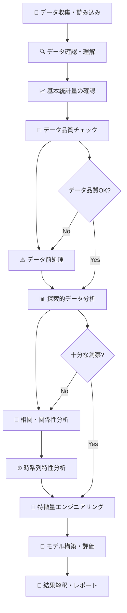

# 🏭 工場データ分析基本フローチャート

このフローチャートは工場のタグデータ（PV値、SV値、MV値等）を分析する際の標準的な手順を示します。
各ステップには具体的なコード例も含まれています。

## 📊 分析フロー全体像



---

## ステップ1️⃣: データ収集・読み込み

### 🎯 目的
- データファイルの読み込み
- 基本的なデータ構造の把握

### 📝 実行コード

```python
import pandas as pd
import numpy as np
import matplotlib.pyplot as plt
import seaborn as sns
from datetime import datetime
import warnings
warnings.filterwarnings('ignore')

# 日本語フォント設定
import japanize_matplotlib
plt.style.use('seaborn-v0_8')

# データ読み込み
df = pd.read_csv('factory_data.csv', 
                 encoding='utf-8',
                 parse_dates=['timestamp'])  # 日時列がある場合

# 基本情報確認
print("📂 データ読み込み完了")
print(f"データ形状: {df.shape}")
print(f"メモリ使用量: {df.memory_usage(deep=True).sum() / 1024**2:.2f} MB")
```

### ✅ チェックポイント
- [ ] ファイルが正常に読み込めた
- [ ] データサイズが予想通り
- [ ] エラーメッセージがない

---

## ステップ2️⃣: データ確認・理解

### 🎯 目的
- データの概要把握
- 列の意味理解
- データ型の確認

### 📝 実行コード

```python
# データ概要
print("=" * 60)
print("🔍 データ概要確認")
print("=" * 60)

# 基本情報
print("■ 基本情報")
print(f"行数: {len(df):,}")
print(f"列数: {len(df.columns)}")
print(f"期間: {df['timestamp'].min()} ～ {df['timestamp'].max()}")

# 列名と型
print("\n■ 列情報")
print(df.dtypes)

# 最初の数行
print("\n■ データサンプル")
print(df.head())

# 列名リスト
print("\n■ 全列名")
print(df.columns.tolist())

# 数値列とカテゴリ列の分離
numeric_cols = df.select_dtypes(include=[np.number]).columns.tolist()
categorical_cols = df.select_dtypes(include=['object', 'category']).columns.tolist()

print(f"\n数値列: {len(numeric_cols)}個")
print(numeric_cols)
print(f"\nカテゴリ列: {len(categorical_cols)}個")
print(categorical_cols)
```

### ✅ チェックポイント
- [ ] 列名が理解できる
- [ ] データ型が適切
- [ ] 期間が予想通り
- [ ] 数値列とカテゴリ列が正しく識別された

---

## ステップ3️⃣: 基本統計量の確認

### 🎯 目的
- 各変数の分布把握
- 異常値の初期検出
- データの範囲確認

### 📝 実行コード

```python
# 基本統計量
print("=" * 60)
print("📈 基本統計量")
print("=" * 60)

# 数値データの統計量
print("■ 数値データ統計量")
stats = df[numeric_cols].describe()
print(stats.round(3))

# より詳細な統計量
from scipy import stats

print("\n■ 詳細統計量")
for col in numeric_cols[:5]:  # 最初の5列のみ表示
    data = df[col].dropna()
    print(f"\n{col}:")
    print(f"  平均: {data.mean():.3f}")
    print(f"  中央値: {data.median():.3f}")
    print(f"  標準偏差: {data.std():.3f}")
    print(f"  変動係数: {data.std()/data.mean():.3f}")
    print(f"  歪度: {stats.skew(data):.3f}")
    print(f"  尖度: {stats.kurtosis(data):.3f}")

# カテゴリデータの確認
if categorical_cols:
    print("\n■ カテゴリデータ")
    for col in categorical_cols:
        print(f"\n{col}の値分布:")
        print(df[col].value_counts())
```

### ✅ チェックポイント
- [ ] 統計量が常識的な範囲内
- [ ] 平均と中央値の差が大きすぎない
- [ ] 変動係数が異常に大きくない

---

## ステップ4️⃣: データ品質チェック

### 🎯 目的
- 欠損値の確認
- 重複データの検出
- 異常値の特定

### 📝 実行コード

```python
print("=" * 60)
print("🧹 データ品質チェック")
print("=" * 60)

# 欠損値確認
print("■ 欠損値確認")
missing_info = df.isnull().sum()
missing_ratio = (missing_info / len(df) * 100).round(2)

missing_summary = pd.DataFrame({
    '欠損数': missing_info,
    '欠損率(%)': missing_ratio
}).sort_values('欠損率(%)', ascending=False)

print(missing_summary[missing_summary['欠損数'] > 0])

# 重複データ確認
print(f"\n■ 重複データ: {df.duplicated().sum()}行")

# 外れ値検出（IQR法）
print("\n■ 外れ値検出（IQR法）")
for col in numeric_cols[:5]:
    Q1 = df[col].quantile(0.25)
    Q3 = df[col].quantile(0.75)
    IQR = Q3 - Q1
    lower_bound = Q1 - 1.5 * IQR
    upper_bound = Q3 + 1.5 * IQR
    
    outliers = df[(df[col] < lower_bound) | (df[col] > upper_bound)]
    outlier_ratio = len(outliers) / len(df) * 100
    
    print(f"{col}: {len(outliers)}個 ({outlier_ratio:.2f}%)")

# データ型の問題確認
print("\n■ データ型確認")
for col in df.columns:
    if df[col].dtype == 'object':
        # 数値のはずなのに文字列になっているかチェック
        try:
            pd.to_numeric(df[col], errors='raise')
            print(f"⚠️ {col}: 数値変換可能だが文字列型")
        except:
            pass
```

### ✅ チェックポイント
- [ ] 欠損率が許容範囲内（通常<5%）
- [ ] 重複データが少ない
- [ ] 外れ値率が異常でない（通常<5%）
- [ ] データ型が適切

---

## ステップ5️⃣: データ前処理

### 🎯 目的
- 欠損値の処理
- 外れ値の処理
- データ型変換

### 📝 実行コード

```python
print("=" * 60)
print("⚠️ データ前処理")
print("=" * 60)

# データのコピーを作成
df_clean = df.copy()

# 1. 欠損値処理
print("■ 欠損値処理")
for col in numeric_cols:
    missing_count = df_clean[col].isnull().sum()
    if missing_count > 0:
        if missing_count / len(df_clean) < 0.05:  # 5%未満なら前方埋め
            df_clean[col].fillna(method='ffill', inplace=True)
            print(f"{col}: 前方埋めで処理 ({missing_count}個)")
        else:  # 5%以上なら平均値
            mean_val = df_clean[col].mean()
            df_clean[col].fillna(mean_val, inplace=True)
            print(f"{col}: 平均値で処理 ({missing_count}個)")

# 2. 外れ値処理（上限・下限設定）
print("\n■ 外れ値処理")
for col in numeric_cols:
    Q1 = df_clean[col].quantile(0.25)
    Q3 = df_clean[col].quantile(0.75)
    IQR = Q3 - Q1
    lower_bound = Q1 - 1.5 * IQR
    upper_bound = Q3 + 1.5 * IQR
    
    # 外れ値をクリッピング
    outliers_before = len(df_clean[(df_clean[col] < lower_bound) | (df_clean[col] > upper_bound)])
    df_clean[col] = df_clean[col].clip(lower=lower_bound, upper=upper_bound)
    
    if outliers_before > 0:
        print(f"{col}: {outliers_before}個の外れ値をクリッピング")

# 3. データ型変換
print("\n■ データ型最適化")
for col in numeric_cols:
    # float64をfloat32に変換（メモリ節約）
    if df_clean[col].dtype == 'float64':
        df_clean[col] = df_clean[col].astype('float32')

print(f"\n前処理完了: {len(df_clean)}行 → メモリ使用量削減")
```

### ✅ チェックポイント
- [ ] 欠損値が適切に処理された
- [ ] 外れ値が処理された
- [ ] データ型が最適化された

---

## ステップ6️⃣: 探索的データ分析（EDA）

### 🎯 目的
- データの分布理解
- 基本的なパターン発見
- 可視化による洞察

### 📝 実行コード

```python
print("=" * 60)
print("📊 探索的データ分析")
print("=" * 60)

# 1. 分布の可視化
fig, axes = plt.subplots(2, 2, figsize=(15, 10))
axes = axes.ravel()

for i, col in enumerate(numeric_cols[:4]):
    axes[i].hist(df_clean[col], bins=30, alpha=0.7, edgecolor='black')
    axes[i].set_title(f'{col}の分布')
    axes[i].set_xlabel(col)
    axes[i].set_ylabel('頻度')

plt.tight_layout()
plt.show()

# 2. 時系列プロット（時間列がある場合）
if 'timestamp' in df_clean.columns:
    fig, axes = plt.subplots(3, 1, figsize=(15, 12))
    
    for i, col in enumerate(numeric_cols[:3]):
        axes[i].plot(df_clean['timestamp'], df_clean[col], alpha=0.7)
        axes[i].set_title(f'{col}の時系列変化')
        axes[i].set_ylabel(col)
        axes[i].grid(True)
    
    axes[-1].set_xlabel('時間')
    plt.tight_layout()
    plt.show()

# 3. ボックスプロット
plt.figure(figsize=(12, 8))
df_clean[numeric_cols[:6]].boxplot()
plt.title('各変数のボックスプロット')
plt.xticks(rotation=45)
plt.tight_layout()
plt.show()

# 4. 基本統計情報の更新確認
print("■ 前処理後の統計量")
print(df_clean[numeric_cols].describe().round(3))
```

### ✅ チェックポイント
- [ ] 分布が理解できた
- [ ] 時系列パターンが見える
- [ ] 異常な値がないか確認

---

## ステップ7️⃣: 相関・関係性分析

### 🎯 目的
- 変数間の関係性把握
- 多重共線性の確認
- 重要な関係性の発見

### 📝 実行コード

```python
print("=" * 60)
print("🔗 相関・関係性分析")
print("=" * 60)

# 1. 相関行列の計算
correlation_matrix = df_clean[numeric_cols].corr()

# 2. 相関行列のヒートマップ
plt.figure(figsize=(12, 10))
sns.heatmap(correlation_matrix, 
            annot=True, 
            cmap='coolwarm', 
            center=0,
            fmt='.2f',
            square=True)
plt.title('変数間相関行列')
plt.tight_layout()
plt.show()

# 3. 高相関ペアの抽出
print("■ 高相関ペア（|r| > 0.7）")
high_corr_pairs = []
for i in range(len(correlation_matrix.columns)):
    for j in range(i+1, len(correlation_matrix.columns)):
        corr_val = correlation_matrix.iloc[i, j]
        if abs(corr_val) > 0.7:
            high_corr_pairs.append({
                '変数1': correlation_matrix.columns[i],
                '変数2': correlation_matrix.columns[j],
                '相関係数': corr_val
            })

if high_corr_pairs:
    high_corr_df = pd.DataFrame(high_corr_pairs)
    print(high_corr_df.sort_values('相関係数', key=abs, ascending=False))
else:
    print("高相関ペアはありません")

# 4. 散布図マトリックス（主要変数のみ）
if len(numeric_cols) > 4:
    main_cols = numeric_cols[:4]
else:
    main_cols = numeric_cols

pd.plotting.scatter_matrix(df_clean[main_cols], 
                          figsize=(12, 12), 
                          alpha=0.6,
                          diagonal='hist')
plt.suptitle('散布図マトリックス')
plt.tight_layout()
plt.show()
```

### ✅ チェックポイント
- [ ] 相関関係が把握できた
- [ ] 多重共線性の問題がないか確認
- [ ] 予想外の関係性がないか確認

---

## ステップ8️⃣: 時系列特性分析

### 🎯 目的
- 時系列パターンの理解
- 周期性・季節性の検出
- トレンドの確認

### 📝 実行コード

```python
print("=" * 60)
print("⏰ 時系列特性分析")
print("=" * 60)

if 'timestamp' in df_clean.columns:
    # 時間インデックス設定
    df_time = df_clean.set_index('timestamp')
    
    # 1. 基本的な時系列統計
    print("■ 時系列基本情報")
    print(f"データ期間: {df_time.index.min()} ～ {df_time.index.max()}")
    print(f"データ間隔: {df_time.index.freq}")
    print(f"総期間: {df_time.index.max() - df_time.index.min()}")
    
    # 2. リサンプリング分析
    print("\n■ 時間別統計")
    
    # 1時間平均
    hourly_avg = df_time[numeric_cols[0]].resample('1H').mean()
    
    # 日別統計
    daily_stats = df_time[numeric_cols[0]].resample('1D').agg(['mean', 'min', 'max', 'std'])
    
    print("日別統計（最初の5日）:")
    print(daily_stats.head())
    
    # 3. 時間別パターン分析
    df_time['hour'] = df_time.index.hour
    df_time['day_of_week'] = df_time.index.dayofweek
    df_time['month'] = df_time.index.month
    
    # 時間別平均
    hourly_pattern = df_time.groupby('hour')[numeric_cols[0]].mean()
    
    plt.figure(figsize=(15, 10))
    
    # 時間別パターン
    plt.subplot(2, 2, 1)
    hourly_pattern.plot(kind='bar')
    plt.title('時間別平均パターン')
    plt.xlabel('時間')
    plt.ylabel(numeric_cols[0])
    
    # 曜日別パターン
    plt.subplot(2, 2, 2)
    dow_pattern = df_time.groupby('day_of_week')[numeric_cols[0]].mean()
    dow_pattern.plot(kind='bar')
    plt.title('曜日別平均パターン')
    plt.xlabel('曜日（0=月曜）')
    plt.ylabel(numeric_cols[0])
    
    # 移動平均
    plt.subplot(2, 2, 3)
    df_time[numeric_cols[0]].plot(alpha=0.3, label='原データ')
    df_time[numeric_cols[0]].rolling(window=24).mean().plot(label='24時間移動平均')
    plt.title('移動平均による平滑化')
    plt.legend()
    
    # 自己相関
    plt.subplot(2, 2, 4)
    from statsmodels.tsa.stattools import acf
    lags = range(0, min(50, len(df_time)//4))
    autocorr = acf(df_time[numeric_cols[0]].dropna(), nlags=len(lags)-1)
    plt.plot(lags, autocorr)
    plt.title('自己相関関数')
    plt.xlabel('ラグ')
    plt.ylabel('自己相関')
    plt.axhline(y=0, color='k', linestyle='-', alpha=0.3)
    
    plt.tight_layout()
    plt.show()
```

### ✅ チェックポイント
- [ ] 時系列パターンが理解できた
- [ ] 周期性があるか確認
- [ ] トレンドの方向性が把握できた

---

## ステップ9️⃣: 特徴量エンジニアリング

### 🎯 目的
- 予測に有用な新しい特徴量作成
- 30分遅れ特徴量の作成
- 統計的特徴量の作成

### 📝 実行コード

```python
print("=" * 60)
print("🎯 特徴量エンジニアリング")
print("=" * 60)

# 特徴量作成のためのDataFrame
df_features = df_clean.copy()

if 'timestamp' in df_features.columns:
    df_features = df_features.set_index('timestamp')

# 1. 遅れ特徴量（30分前の値）
print("■ 遅れ特徴量作成")
lag_periods = [6, 12, 24]  # 5分間隔なら30分、1時間、2時間

for col in numeric_cols[:3]:  # 主要な列のみ
    for lag in lag_periods:
        new_col = f"{col}_lag{lag*5}min"
        df_features[new_col] = df_features[col].shift(lag)
        print(f"作成: {new_col}")

# 2. 移動平均特徴量
print("\n■ 移動平均特徴量作成")
windows = [5, 10, 20]  # 25分、50分、100分

for col in numeric_cols[:3]:
    for window in windows:
        new_col = f"{col}_ma{window*5}min"
        df_features[new_col] = df_features[col].rolling(window=window).mean()
        print(f"作成: {new_col}")

# 3. 差分特徴量
print("\n■ 差分特徴量作成")
for col in numeric_cols[:3]:
    df_features[f"{col}_diff"] = df_features[col].diff()
    df_features[f"{col}_pct_change"] = df_features[col].pct_change()
    print(f"作成: {col}_diff, {col}_pct_change")

# 4. 統計特徴量（ローリング統計）
print("\n■ ローリング統計特徴量作成")
for col in numeric_cols[:2]:
    window = 20
    df_features[f"{col}_rolling_std"] = df_features[col].rolling(window=window).std()
    df_features[f"{col}_rolling_min"] = df_features[col].rolling(window=window).min()
    df_features[f"{col}_rolling_max"] = df_features[col].rolling(window=window).max()
    print(f"作成: {col}のローリング統計量")

# 5. 時間特徴量
print("\n■ 時間特徴量作成")
if df_features.index.dtype.kind == 'M':  # datetime index
    df_features['hour'] = df_features.index.hour
    df_features['day_of_week'] = df_features.index.dayofweek
    df_features['month'] = df_features.index.month
    df_features['is_weekend'] = (df_features.index.dayofweek >= 5).astype(int)
    df_features['is_night'] = ((df_features.index.hour >= 22) | (df_features.index.hour <= 6)).astype(int)
    print("作成: hour, day_of_week, month, is_weekend, is_night")

# 6. 交互作用特徴量
print("\n■ 交互作用特徴量作成")
if len(numeric_cols) >= 2:
    df_features[f"{numeric_cols[0]}_{numeric_cols[1]}_ratio"] = df_features[numeric_cols[0]] / (df_features[numeric_cols[1]] + 1e-8)
    df_features[f"{numeric_cols[0]}_{numeric_cols[1]}_diff"] = df_features[numeric_cols[0]] - df_features[numeric_cols[1]]
    print(f"作成: {numeric_cols[0]}と{numeric_cols[1]}の比率・差分")

print(f"\n特徴量エンジニアリング完了: {len(df_features.columns)}列")
print("新しい特徴量リスト:")
new_features = [col for col in df_features.columns if col not in df_clean.columns]
print(new_features[:10])  # 最初の10個を表示
```

### ✅ チェックポイント
- [ ] 30分遅れ特徴量が作成された
- [ ] 移動平均特徴量が作成された
- [ ] 時間特徴量が作成された

---

## ステップ🔟: モデル構築・評価

### 🎯 目的
- 予測モデルの構築
- 時系列分割による適切な評価
- 特徴量重要度の確認

### 📝 実行コード

```python
print("=" * 60)
print("🤖 モデル構築・評価")
print("=" * 60)

from sklearn.model_selection import TimeSeriesSplit
from sklearn.ensemble import RandomForestRegressor
from sklearn.metrics import mean_absolute_error, mean_squared_error, r2_score
from sklearn.preprocessing import StandardScaler

# 1. ターゲット変数設定（水分計の30分後の値を予測）
target_col = numeric_cols[0]  # 最初の数値列をターゲットとして使用
df_model = df_features.copy()

# 30分後の値を作成
df_model['target'] = df_model[target_col].shift(-6)  # 30分後

# 2. 特徴量とターゲットの準備
feature_cols = [col for col in df_model.columns if col != 'target' and not col.startswith(target_col + '_lag')]
X = df_model[feature_cols].dropna()
y = df_model['target'].dropna()

# データの整合性確保
min_len = min(len(X), len(y))
X = X.iloc[:min_len]
y = y.iloc[:min_len]

print(f"特徴量数: {len(feature_cols)}")
print(f"サンプル数: {len(X)}")

# 3. 時系列分割による評価
tscv = TimeSeriesSplit(n_splits=5)
rf = RandomForestRegressor(n_estimators=100, random_state=42)

mae_scores = []
rmse_scores = []
r2_scores = []

print("\n■ 時系列交差検証結果")
for fold, (train_idx, test_idx) in enumerate(tscv.split(X)):
    X_train, X_test = X.iloc[train_idx], X.iloc[test_idx]
    y_train, y_test = y.iloc[train_idx], y.iloc[test_idx]
    
    # 欠損値処理
    X_train = X_train.fillna(X_train.mean())
    X_test = X_test.fillna(X_train.mean())
    
    # モデル学習
    rf.fit(X_train, y_train)
    y_pred = rf.predict(X_test)
    
    # 評価
    mae = mean_absolute_error(y_test, y_pred)
    rmse = np.sqrt(mean_squared_error(y_test, y_pred))
    r2 = r2_score(y_test, y_pred)
    
    mae_scores.append(mae)
    rmse_scores.append(rmse)
    r2_scores.append(r2)
    
    print(f"Fold {fold+1}: MAE={mae:.3f}, RMSE={rmse:.3f}, R2={r2:.3f}")

print(f"\n平均性能: MAE={np.mean(mae_scores):.3f}±{np.std(mae_scores):.3f}")
print(f"平均性能: RMSE={np.mean(rmse_scores):.3f}±{np.std(rmse_scores):.3f}")
print(f"平均性能: R2={np.mean(r2_scores):.3f}±{np.std(r2_scores):.3f}")

# 4. 特徴量重要度
X_full = X.fillna(X.mean())
rf.fit(X_full, y)

importance_df = pd.DataFrame({
    'feature': feature_cols,
    'importance': rf.feature_importances_
}).sort_values('importance', ascending=False)

print("\n■ 特徴量重要度（上位10個）")
print(importance_df.head(10))

# 5. 予測結果の可視化
y_pred_full = rf.predict(X_full)

plt.figure(figsize=(15, 8))

plt.subplot(2, 1, 1)
plt.plot(y.index[-200:], y.iloc[-200:], label='実測値', alpha=0.7)
plt.plot(y.index[-200:], y_pred_full[-200:], label='予測値', alpha=0.7)
plt.title('予測結果（最新200点）')
plt.legend()
plt.grid(True)

plt.subplot(2, 1, 2)
plt.scatter(y, y_pred_full, alpha=0.5)
plt.plot([y.min(), y.max()], [y.min(), y.max()], 'r--')
plt.xlabel('実測値')
plt.ylabel('予測値')
plt.title('実測値 vs 予測値')
plt.grid(True)

plt.tight_layout()
plt.show()
```

### ✅ チェックポイント
- [ ] モデルが正常に学習できた
- [ ] 評価指標が妥当な範囲
- [ ] 重要な特徴量が特定できた

---

## ステップ1️⃣1️⃣: 結果解釈・レポート

### 🎯 目的
- 分析結果のまとめ
- ビジネス価値の解釈
- 次のアクションの提案

### 📝 実行コード

```python
print("=" * 80)
print("📝 分析結果レポート")
print("=" * 80)

# 1. 分析サマリー
print("■ 分析サマリー")
print(f"分析対象期間: {df['timestamp'].min()} ～ {df['timestamp'].max()}")
print(f"データ件数: {len(df):,}件")
print(f"分析変数: {len(numeric_cols)}個")
print(f"作成特徴量: {len(new_features)}個")
print(f"予測精度: R2 = {np.mean(r2_scores):.3f}")

# 2. 主要な発見事項
print("\n■ 主要な発見事項")

# データ品質
missing_ratio = df.isnull().sum().sum() / (len(df) * len(df.columns)) * 100
print(f"1. データ品質: 欠損率 {missing_ratio:.2f}%")

# 相関関係
if high_corr_pairs:
    strongest_corr = max(high_corr_pairs, key=lambda x: abs(x['相関係数']))
    print(f"2. 最強相関: {strongest_corr['変数1']} vs {strongest_corr['変数2']} (r={strongest_corr['相関係数']:.3f})")

# 重要特徴量
top_feature = importance_df.iloc[0]
print(f"3. 最重要特徴量: {top_feature['feature']} (重要度: {top_feature['importance']:.3f})")

# 予測性能
print(f"4. 予測性能: MAE={np.mean(mae_scores):.3f} (30分先予測)")

# 3. 推奨アクション
print("\n■ 推奨アクション")
print("1. 🎯 即座に実行すべき項目:")
if missing_ratio > 5:
    print("   - 欠損値発生原因の調査と対策")
if np.mean(r2_scores) < 0.8:
    print("   - 追加特徴量の検討")
    print("   - より高度なモデル（LSTM等）の検討")

print("\n2. 🔄 継続的に改善すべき項目:")
print("   - データ収集頻度の最適化")
print("   - 外れ値検出アラームの設置")
print("   - モデルの定期的な再学習")

print("\n3. 📊 さらなる分析が必要な項目:")
print("   - 設備の物理的制約との整合性確認")
print("   - 季節変動の詳細分析")
print("   - 異常パターンの分類")

# 4. ファイル出力
print("\n■ 結果ファイル出力")

# 重要な結果をCSVで保存
importance_df.to_csv('feature_importance.csv', index=False, encoding='utf-8')
print("特徴量重要度: feature_importance.csv")

# 予測結果の保存
results_df = pd.DataFrame({
    'timestamp': y.index,
    'actual': y.values,
    'predicted': y_pred_full
})
results_df.to_csv('prediction_results.csv', index=False, encoding='utf-8')
print("予測結果: prediction_results.csv")

print("\n✨ 分析完了！次のステップに進んでください。")
```

### ✅ 最終チェックポイント
- [ ] 分析結果が適切にまとめられた
- [ ] ビジネス価値が明確になった
- [ ] 次のアクションが具体的に提示された
- [ ] 結果ファイルが出力された

---

## 📋 分析チェックリスト

### 事前準備
- [ ] データファイルの準備
- [ ] 必要ライブラリのインストール
- [ ] 分析目的の明確化

### 実行チェック
- [ ] 各ステップが正常に実行された
- [ ] エラーがない
- [ ] 結果が期待通り

### 品質チェック
- [ ] データ品質が許容範囲
- [ ] 統計量が常識的
- [ ] 予測性能が実用的

### 成果物チェック
- [ ] グラフが保存された
- [ ] 結果ファイルが出力された
- [ ] レポートが完成した

---

## 🚀 次のステップ提案

1. **モデルの改善**
   - LSTM、XGBoostなどの高度なモデル試行
   - ハイパーパラメータ最適化
   - アンサンブル手法の適用

2. **リアルタイム化**
   - ストリーミングデータ対応
   - オンライン学習の実装
   - 異常検知システムの構築

3. **業務統合**
   - 現場オペレータとの連携
   - 既存システムとの統合
   - 継続的な改善プロセスの確立

このフローチャートに従って分析を進めることで、工場データから価値のある洞察を効率的に抽出できます！ 